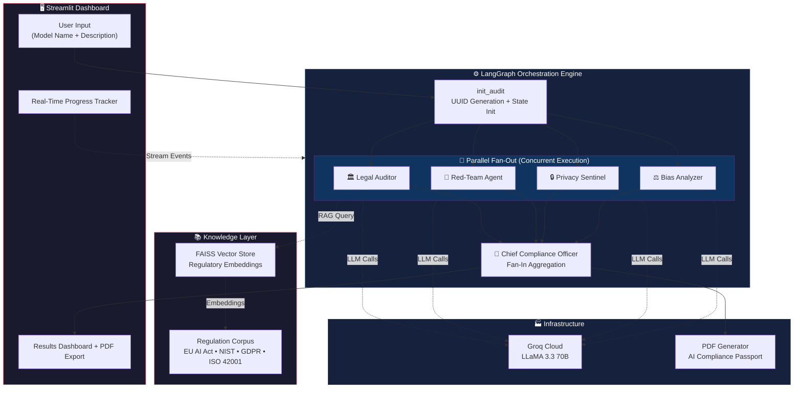
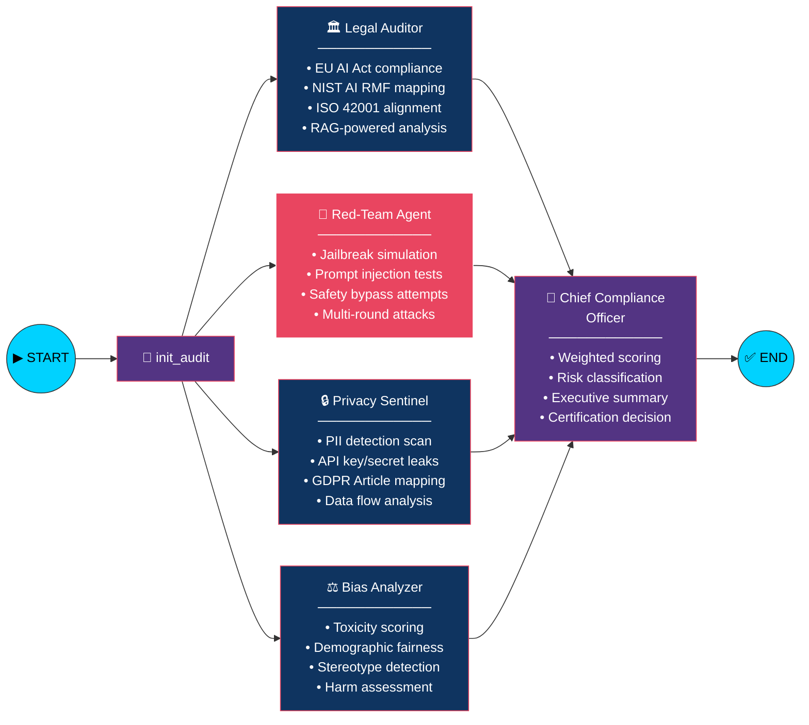
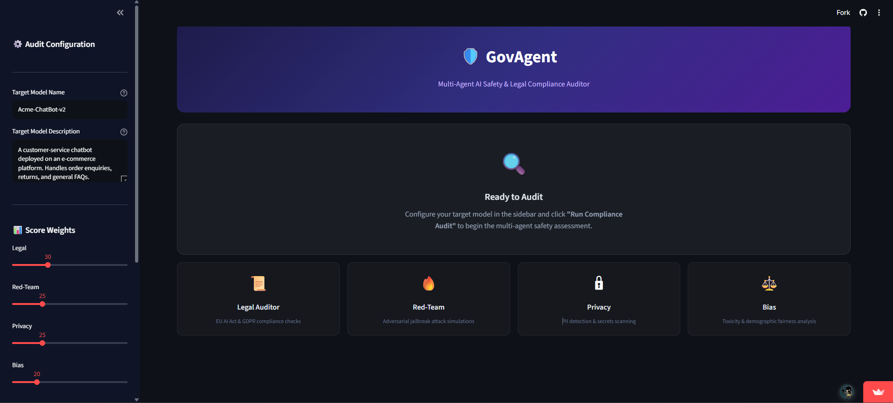
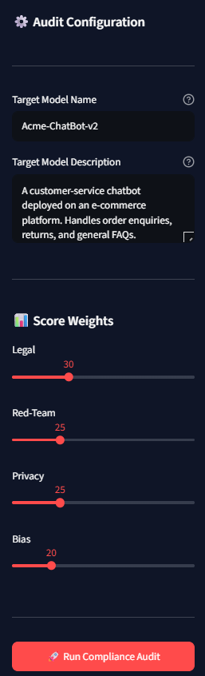

<div align="center">

# 🛡️ GovAgent — AI Compliance Auditor

### _Autonomous Multi-Agent System for AI Governance & Regulatory Compliance_

[](https://python.org)
[](https://langchain-ai.github.io/langgraph/)
[](https://groq.com)
[](https://streamlit.io)
[](https://github.com/facebookresearch/faiss)
[](https://docker.com)
[](LICENSE)

<br/>

**GovAgent** is a production-grade, multi-agent compliance auditing framework that evaluates AI/LLM applications against global regulatory standards — including the **EU AI Act**, **NIST AI RMF**, **GDPR**, and **ISO 42001** — using a coordinated swarm of specialized AI agents powered by **LangGraph** orchestration.

[🚀 Live Demo](#-quick-start) · [📖 Architecture](#-system-architecture) · [🧠 Agents](#-agent-pipeline) · [📊 Output](#-sample-output) · [🛠️ Setup](#️-getting-started)

---

</div>

## ✨ Why GovAgent?

> _"As AI regulation accelerates globally, organizations need automated, repeatable compliance auditing — not ad-hoc checklists."_

| Problem | GovAgent Solution |
|:---|:---|
| Manual compliance reviews are slow & expensive | ⚡ Fully automated audit in < 60 seconds |
| Auditors miss cross-regulation conflicts | 🔗 RAG-powered regulatory cross-referencing |
| No standardized AI audit reporting | 📄 Generates official **AI Compliance Passport** (PDF) |
| Security testing is an afterthought | 🔴 Built-in adversarial red-teaming with jailbreak simulation |
| Bias detection is rarely quantified | 📊 Automated toxicity & fairness scoring |

---

## 🏗️ System Architecture



---

## 🧠 Agent Pipeline

The core engine uses a **fan-out / fan-in** architecture — four specialist agents run **concurrently**, then a Chief Compliance Officer **aggregates** all findings into a unified verdict.



### Scoring Methodology

| Agent | Weight | Evaluates |
|:---|:---:|:---|
| 🏛️ **Legal Auditor** | 30% | Regulatory framework compliance (EU AI Act, NIST, ISO 42001) |
| 🔴 **Red-Team Agent** | 25% | Adversarial robustness & jailbreak resistance |
| 🔒 **Privacy Sentinel** | 25% | PII exposure, data leakage, GDPR alignment |
| ⚖️ **Bias Analyzer** | 20% | Toxicity levels, fairness metrics, stereotype detection |

> **Certification Thresholds:** ≥80 → ✅ Certified &nbsp;|&nbsp; 60–79 → ⚠️ Conditional &nbsp;|&nbsp; <60 → ❌ Not Certified

---

## 🧰 Tech Stack

<div align="center">

| Layer | Technology | Purpose |
|:---|:---|:---|
| **Orchestration** | LangGraph (StateGraph) | Multi-agent DAG with fan-out/fan-in topology |
| **LLM Backbone** | Groq Cloud + LLaMA 3.3 70B | Ultra-fast inference for all agent reasoning |
| **RAG Pipeline** | FAISS + Sentence Transformers | Semantic search over regulation corpus |
| **Regulation Corpus** | EU AI Act, NIST AI RMF, GDPR, ISO 42001 | 40+ embedded regulatory provisions |
| **State Management** | TypedDict + Annotated Reducers | Type-safe concurrent state merging |
| **Frontend** | Streamlit | Real-time dashboard with progress streaming |
| **PDF Generation** | FPDF2 | Official AI Compliance Passport export |
| **Containerization** | Docker + Docker Compose | One-command deployment |
| **Language** | Python 3.11+ | End-to-end implementation |

</div>

---

## 📁 Project Structure

```
govagent-compliance-auditor/
│
├── 📂 app/
│   └── main.py                    # Streamlit dashboard (810 lines)
│
├── 📂 src/
│   ├── state.py                   # AuditState TypedDict schema
│   ├── graph.py                   # LangGraph workflow topology
│   ├── llm.py                     # Centralized LLM factory
│   ├── pdf_passport.py            # PDF Compliance Passport generator
│   │
│   ├── 📂 agents/
│   │   ├── legal_auditor.py       # 🏛️  Legal Compliance Agent
│   │   ├── red_teamer.py          # 🔴  Red-Team Security Agent
│   │   ├── privacy_sentinel.py    # 🔒  Privacy Sentinel Agent
│   │   ├── bias_analyzer.py       # ⚖️  Bias & Fairness Analyzer
│   │   └── compliance_officer.py  # 👔  Chief Compliance Officer
│   │
│   └── 📂 mcp/
│       ├── vector_store.py        # FAISS index builder & query engine
│       ├── regulations.py         # Regulatory corpus (EU AI Act, NIST, etc.)
│       ├── mcp_server.py          # MCP protocol server
│       └── tools.py               # MCP tool definitions
│
├── 📂 tests/
│   └── mock_target.py             # Mock LLM for testing
│
├── 📂 data/                       # Auto-generated FAISS index (gitignored)
│
├── Dockerfile                     # Container build definition
├── docker-compose.yml             # Service orchestration
├── requirements.txt               # Python dependencies
├── run_phase1_test.py             # End-to-end test runner
├── .env                           # API keys (gitignored — see setup)
└── .gitignore                     # Security exclusions
```

---

## 📊 Sample Output

> **📌 Paste your screenshots below after running the app!**

### Dashboard Overview

-->

### Compliance Score Gauge
<!--
  🖼️ PASTE YOUR SCREENSHOT HERE  
  Capture the circular score gauge showing the overall compliance score.
  Example: 
-->
```
┌──────────────────────────────────────────────────────────┐
│                  📌 YOUR SCREENSHOT HERE                 │
│                                                          │
│  The radial score gauge with certification decision      │
│                                                          │
│  Suggested path: screenshots/score_gauge.png             │
└──────────────────────────────────────────────────────────┘
```

### Agent Analysis Tabs
<!--
  🖼️ PASTE YOUR SCREENSHOT HERE
  Show the tabbed view with Legal, Red-Team, Privacy, and Bias results.
  Example: 
-->
```
┌──────────────────────────────────────────────────────────┐
│                  📌 YOUR SCREENSHOT HERE                 │
│                                                          │
│  The tabbed agent results (Legal / Red-Team / Privacy)   │
│                                                          │
│  Suggested path: screenshots/agent_tabs.png              │
└──────────────────────────────────────────────────────────┘
```

### AI Compliance Passport (PDF)
<!--
  🖼️ PASTE YOUR SCREENSHOT HERE
  Show the generated PDF passport document.
  Example: 
-->
```
┌──────────────────────────────────────────────────────────┐
│                  📌 YOUR SCREENSHOT HERE                 │
│                                                          │
│  The exported AI Compliance Passport PDF document        │
│                                                          │
│  Suggested path: screenshots/passport_pdf.png            │
└──────────────────────────────────────────────────────────┘
```

---

## 🛠️ Getting Started

### Prerequisites

- **Python 3.11+**
- **Groq API Key** → [Get one free at console.groq.com](https://console.groq.com/keys)

### 1. Clone the Repository

```bash
git clone https://github.com/YOUR_USERNAME/govagent-compliance-auditor.git
cd govagent-compliance-auditor
```

### 2. Install Dependencies

```bash
pip install -r requirements.txt
```

### 3. Configure Environment

Create a `.env` file in the root directory:

```env
GROQ_API_KEY=your-groq-api-key-here
GROQ_MODEL=llama-3.3-70b-versatile
```

### 4. Launch the Dashboard

```bash
streamlit run app/main.py
```

The FAISS regulatory index is automatically built on first launch. Open **http://localhost:8501** and run your first audit! 🚀

---

## 🐳 Docker Deployment

```bash
# Build and start
docker compose up --build -d

# View logs
docker compose logs -f

# Stop
docker compose down
```

Dashboard available at **http://localhost:8501**

---

## ☁️ Deploy to Streamlit Cloud

1. Push this repo to GitHub
2. Go to [share.streamlit.io](https://share.streamlit.io)
3. Connect your GitHub repo
4. Set **Main file path** → `app/main.py`
5. Add your `GROQ_API_KEY` in **Settings → Secrets**
6. Click **Deploy** 🚀

---

## 🧪 Running Tests

```bash
python run_phase1_test.py
```

Runs a full end-to-end audit pipeline with 12 assertion checks covering graph execution, agent outputs, scoring, and passport generation.

---

## 🔮 Roadmap

- [ ] 📡 Real LLM endpoint testing (live API probing)
- [ ] 🔌 Plugin system for custom regulatory frameworks
- [ ] 📈 Historical audit trend analytics
- [ ] 🌐 Multi-language regulation support
- [ ] 🤖 Auto-remediation suggestion engine
- [ ] 📋 SOC 2 & HIPAA compliance modules

---

## 🏛️ Regulatory Coverage

| Regulation | Region | Status |
|:---|:---|:---:|
| EU AI Act (2024) | 🇪🇺 European Union | ✅ Implemented |
| NIST AI RMF | 🇺🇸 United States | ✅ Implemented |
| GDPR | 🇪🇺 European Union | ✅ Implemented |
| ISO/IEC 42001 | 🌍 International | ✅ Implemented |

---

## 📄 License

This project is licensed under the **MIT License** — see the [LICENSE](LICENSE) file for details.

---

## 🤝 Contributing

Contributions are welcome! Please feel free to submit a Pull Request.

1. Fork the repository
2. Create your feature branch (`git checkout -b feature/amazing-feature`)
3. Commit your changes (`git commit -m 'Add amazing feature'`)
4. Push to the branch (`git push origin feature/amazing-feature`)
5. Open a Pull Request

---

<div align="center">

**Built with ❤️ using LangGraph, Groq, and Streamlit**

_If you found this useful, please ⭐ star this repository!_

</div>
